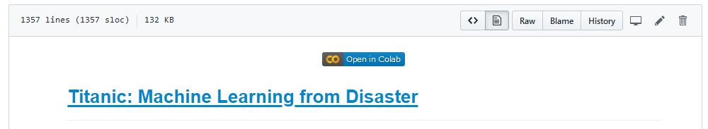

# Titanic: Machine Learning From Disaster | Kaggle

The infamous Titanic competition from Kaggle. **VERY** begiiner friendly & is the perfect competition to start out with on Kaggle competitions.

Key takeaways from this competition are:

- Easy to manage, clean & small enough data set with very few missing values.
- The time limit for the competition is very long as well which is perfect opportunity for beginner enthusiasts to take their time and grasp in everything on their schedule.
- Lots of beginner friendly resources are available such as this one to provide a starting ground.
- Easy classification algorithms like Random Forests work on the competition to get a top 50-25% ranking on the leaderboard.

## What This Repository is About?

It's a beginner friendly project for anyone starting out with trying to learn Data Science. The repository contains Jupyter Notebooks which can be opened on [Google Colab](https://colab.research.google.com) for easy & quick access. On a side note, the notebooks are also available as read-only through [GitHub's nbviewer](https://nbviewer.jupyter.org/) capabilities.

## How to Utilize the Repo?

***Recommended***

**[Google Colab](https://colab.research.google.com)**:

- Accessible on top of each of the notebook is a button, as shown in the image below. Clicking it should open an individual Colab instance specific for that notebook. 

- It is recommend that a copy of the instance is saved in the personal Google Drive as well for instant availability.

- Connect to a Runtime & after a successfully connection, press `ctrl+f9` to execute every cell in the notebook.

- Also it is ***highly recommended*** that you create an individual folder name `Titanic` on your Drive so that the datasets are automatically downloaded from Kaggle using the [Kaggle API](https://github.com/Kaggle/kaggle-api).

**On you Local Machine**:

- Clone the repository by executing the command - `git clone https://github.com/Jarmos-san/Titanic.git` and letting `git` download the `.ipynb` files locally to your machine.
- Install the necessary libraries by running `pip install --user pandas numpy matplotlib scikit-learn missingno`, if you dont have the libraries installed on your system already. Besides, it is advisable to install the libraries in a virtual environment but the `--user` flag should install the libraries for the specific user without throwing an error. For information on creating & using virtual environments, refer to the [official Python `venv` docs](https://docs.python.org/3/library/venv.html).
- Once downloaded, execute `jupyter notebook` command from the terminal & a Jupyter Notebook session should start up. Navigate to the directory where the `ipynb` notebooks were downloaded from this repository & execute all the cells as per the available shortcut. For information on Jupyter Notebooks head over to the [official docs](https://jupyter.org/documentation).

## Contributing to the Repo

Contributions to the repository are highly appreciate & I gladly welcome contributions to the project. But to keep things organized, regardless of how trivial it might be, it's a humble request that you follow these steps:

- Create an issue detailing what changes should be made.
- Fork the repository.
- Make changes to the repository on your profile & make a pull request stating it in the issue that was created.
- Bear in mind the repository is perfect for beginners to work on and get a gist of open-source contributions, hence it would be nice to help every fellow beginner out there with all the information, he/she requires.

## License

The repo is licenses under the T&Cs of the GNU General Public License v3.0, the details of which are available at [LICENSE](LICENSE)!
